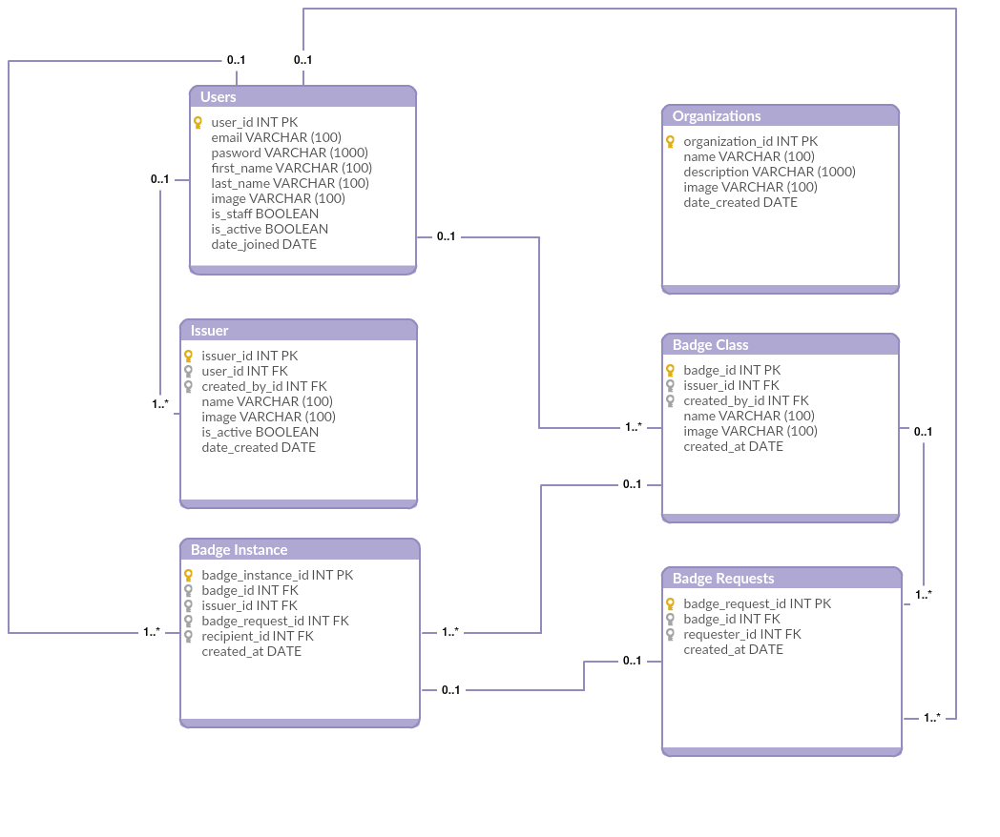

# ECS server

Use Case when a user first registers a account in the app:

  - User should have a unique ID
  - When user is registered with his/her information, Server creates a Unique string (Might be from user details | only user id | totally random string) which will be sent to mobile App
  - Using this unique string app generates a unique QR code for the user and displays it to user.

Use Case when a user tries to get authorization for any resource:
  - User should display his/her QR code to admin
  - Admin should scan the QR code and app sends ID of QR code which was used to generate it to server for verification and user details.
  - Server verifies the unique ID and send back the user information to the app.
  - Admin validates the information and the user for authorization of the resources.

> For securing the server API we will be using JWT token 
> as JWT tokens are light weight and also the token is minimal
> and contain data as well.
> We can figure out another security mechanism if we find any better way
> of securing the APIs.

###Data design

###APIs

Users:
  - POST : users #Creates a new user
  - GET : users #Retrives users list for admin
  - GET : user #Retrives currently logged in user
  - PUT : user #Updates currently logged in user
  - POST : user/forget-password #Request an account recovery method (email or sms)
  - PUT : user/forget-password #Updates a user password after verification
  - GET : user/badges #Retrives list of valid badges assigned to currently logged in user
  - GET : user/badges/id #Retrives a badge information assigned to currently logged in user
  - 
Issuers:
  - POST : issuers #Creates a new issuer
  - GET : issuers #Retrives issuers list for admin
  - GET : issuer #Retrives currently logged in issuer
  - PUT : issuer #Updates currently logged in issuer
  - GET : issuer/badge-requests #Retrives list of badge request for an issuer
  - GET : issuer/badge-issued #Retrives list of badge issued by an issuer
  
Badges:
  - POST : badges #Creates a new badge
  - GET : badges #Retrives badges list for admin and users
  - PUT : badges #Updates a badge according to id
